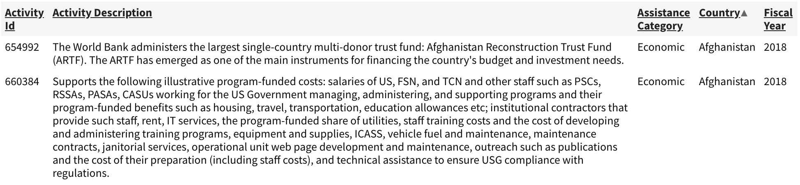
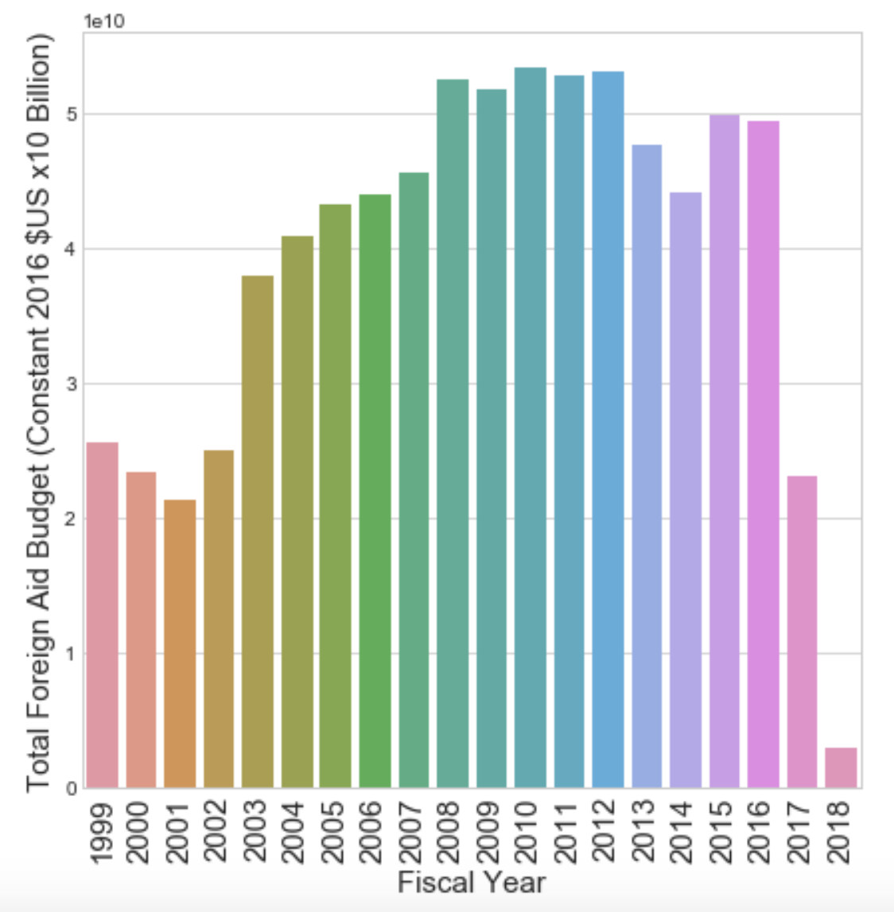
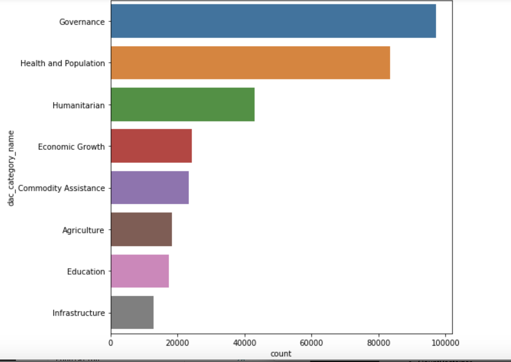
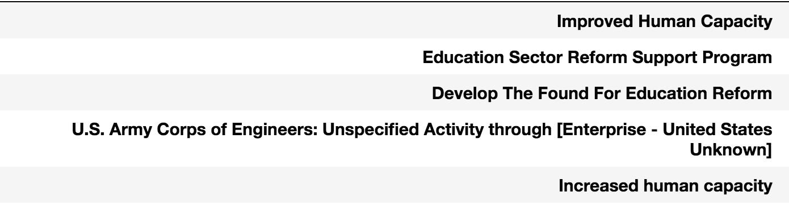
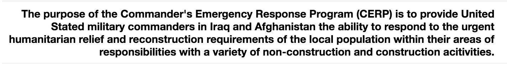
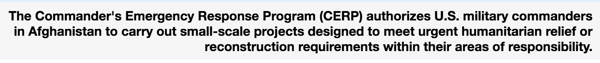

 

# Natural Language Processing of US Foreign Aid Descriptions

## Can Natural Language Processing be used to gain insight on large datasets of US foreign aid? 

## Hypothesis:
### NLP can efficiently identify projects from a large database for further investigation of their classification. 

# Table of Contents
1. [Dataset](#dataset)
2. [Setup](setup)
    * [Categories](#categories)
    * [Data Processing](#data-processing)
3. [Modeling](#modeling)
5. [Insights](#insights)    
6. [Future Directions](#future-directions)

# Dataset

* The United States Agency for International Development (USAID) reports data on US foreign aid projects in accordance with standards established by the Organization for Economic Co-operation and Development (OECD). 

* Member countries self-report project data to the OECD.  In 2017 alone, USAID reported more than 20,000 foreign aid projects. 

* USAID provides foreign aid project data at [USAID Data Querry](https://explorer.usaid.gov/query). There are over 467,000 records available dating to 1946.  

# The Data
 
 

## Yearly Foreign Aid Expenditures 1999 - 2018( ~ March)

# Setup

### I tried to make a prediction model that could efficiently identify foreign aid projects with classifications which could be further investigated.

* Corpus: 319,974 foreign aid project descriptions (projects between 1999 and 2018)
* Targets: category classification of foreign aid projects

## Categories

## Data Processing ([code](https://github.com/dslachar/capstone_2))

* Create main data frame with all records from 1999 - 2018
* Retaine the following fields:
	* Fiscal Year
	* Activity Description
	* Assistance Category 	
* Remove records with the following Assistance Categories: 
	* Administrative Costs 	
	* Other 
* Remove records with null values (4 null values)
*  Test/Train Split

## Text Transform

* Pipeline to transform text
	* CountVectoizer
	* Tfidf Transform 	 	 

## Modeling([code](https://github.com/dslachar/capstone_2))

#### Fit the test data to two different models:
	
	* SKLearn Multinomial Naive Bayes
	* SKLearn Linear Support Vector Machine

#### Multinomial Naive Bayes achieves a slightly better accuracy score.

	* Naive Bayes Accuracy Score: 0.852 (95% CI 0.849 - 0.854)
	* Linear SVM Accuracy Score: 0.839

# Insights

## Can these classification models be used to gain insight into US Foreign Aid Classification?

## 1. Identify Categories more prone to misclassification.

| Category | Accuracy |
| ------- | -----|
|Agriculture| 0.760 |
|Commodity Assistance| 0.847|
|**Economic Growth**| **0.702** |
|**Education**| **0.667** |
|Governance| 0.924 |
|Health and Population| 0.888 |
|Humanitarian| 0.849 |
|Infrastructure| 0.750 |

## 2. Pull activity descriptions which were misclassified.

### In many cases, it appeared activity descriptions were misclassified because of brevity of text...

#### USAID classification: Education 
#### My model prediction: Governance

###or had obvious overlap between two categories...

#### USAID classification: Education 
#### My model prediction: Governance

### however, visually scanning the misclassification tables, I did find a few interesting classifications -  

#### USAID classification: Education 
#### My model prediction: Governance 

### It would be interesting to dig deeper into the CERP program to see if the money is being used for educational purposes.

# Further Exploration
* Cluster on the misclassification tables to see why projects are misclassified.

## References
[https://explorer.usaid.gov/](https://explorer.usaid.gov/)

   
